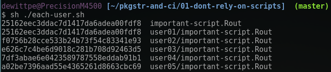

# Preface
Not going to be a safe space...

## Adopt these tools because ...

  
  Me: The following tools will facilitate high quality reproducible reports... 

&nbsp;

&nbsp;

  
  Audience: ... I do just fine.  I make reproducible reports.  This [expletive]
  just wants to complicate things...

## Okay, fine. how about this?

* "Do this, it is good for you."  ... that is as effective as telling my toddler
  to each vegetables.

* Instead, I'm going to revisit some of the less pleasant experiences in my
  career and show how R packages, version control, and CI would have prevented
  these events from ever taking place.

&nbsp;

 *"Learn from the mistakes of others.* 

 *You can't live long enough to make them all yourself."* 
 

 *-- Eleanor Roosevelt* 

# 01: Do not rely on scripts

## Consider the following

* You've done an data analysis project.  Wrote `imporant-script.R`.

* Your colleague will run the script.

* Your supervisor, the one that *thinks* they are a data analyst will run your
  script.

* You work is part of a federally funded project and is subject to Freedom Of
  Information Act (FOIA).  Joe Public is a supper sceptic and is looking for any
  reason to discredit the work.

* Excrement flows down hill.  Where are you on the company organization chart?

## Example

 

  

* I have copied several of the data sets from the
  [nycflights13](https://cran.r-project.org/package=nycflights13) package as
  .csv

* There are five subdirectorys to represent five different users.
  
* `imporant-script.R`: a simple data load, explore, simple
  summary and a simple regression model.

* The `each-user.sh` bash script will evaluate `imporant-script.R` in each user
  directory.

* Let's review some files on the next slide.

 <!-- end id="leftcol" -->

<iframe src="../01-dont-rely-on-scripts/tree.html"></iframe>

 <!-- end id="rightcol"-->

 <!-- end table-row -->

## Example: `important-script.R`

<iframe src="../01-dont-rely-on-scripts/important-script.R"></iframe>

## Example: `each-user.sh`

    #!/bin/bash

    ARGS="--no-timing --no-save"

    R CMD BATCH $ARGS important-script.R 

    cd user01
    R CMD BATCH $ARGS important-script.R 

    cd ../user02
    R CMD BATCH $ARGS important-script.R 

    cd ../user03
    R CMD BATCH $ARGS important-script.R 

    cd ../user04
    R CMD BATCH $ARGS important-script.R 

    cd ../user05
    R CMD BATCH $ARGS important-script.R 

    cd ..  
    md5sum important-script.Rout \
           user01/important-script.Rout \
           user02/important-script.Rout \
           user03/important-script.Rout \
           user04/important-script.Rout \
           user05/important-script.Rout

## Example: Evaluate `important-script.R`

* My version and user01 have the same output.

* No other user has the same output!

* Maybe the differences are minor?

* Let's look at the output and then the differences between the "expected" and
  the output for users 02, 03, 04, and 05.

## Expected Output
<iframe src="important-script.Rout.html"> </iframe>

## Diff between Primary and User05

<iframe src="vs-user05.html"> </iframe>
