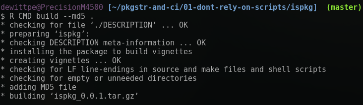

# Preface


## Adopt these tools because ...

<p>
  
  Me: The following tools will facilitate high quality reproducible reports...
</p>

<br>
<p>
&nbsp;
</p>
<br>

<p>
  
  Audience: ... I do just fine.  I make reproducible reports.  This [expletive]
  just wants to complicate things...
</p>

## Okay, fine. How about this?

* "Do this, it is good for you."  ... that is as effective as telling my toddler
  to each vegetables.

* Instead:

    * Show that sending a generic R script **is not** going to generate
      reproducible results.

    * Revisit some of the less pleasant experiences in my career and show how R
      packages, version control, and CI would have prevented these events from
      ever taking place.

<br> <br>
<p style="text-align:right"> *"Learn from the mistakes of others.* <br>
*You can't live long enough to make them all yourself."* </p>
<p style="text-align:right"> *-- Eleanor Roosevelt* </p>

<!-- ....................................................................... -->
# Do not rely on scripts

## Consider the following

* You've done an data analysis project.  Wrote `important-script.R`.

* Your colleague will run the script.

* A supervisor, the one who *thinks* they are a data analyst, will run your
  script.

* You work is part of a federally funded project and is subject to Freedom Of
  Information Act (FOIA).  Joe Public is a skeptic and is looking for any
  reason to discredit the work.

* Excrement flows downhill.  Where are you on the company organization chart?

## Example

<div style="width: 100%; display: table;">
 <div style="display: table-row">
  <div id="leftcol" style="width: 50%; display: table-cell; vertical-align: top;">

* I have copied several of the data sets from the
  [nycflights13](https://cran.r-project.org/package=nycflights13) package as
  .csv

* There are five subdirectories to represent five different users.

* `important-script.R`: a simple data load, explore, simple
  summary and a simple regression model.

* The `each-user.sh` bash script will evaluate `important-script.R` in each user
  directory.

* Let's review some files on the next slide.

</div> <!-- end id="leftcol" -->
<div id="rightcol" style="display: table-cell; vertical-align: top;">
<iframe src="tree.html"></iframe>
</div> <!-- end id="rightcol"-->
</div> <!-- end table-row -->
</div>

## Example: `important-script.R`

<iframe src="important-script.R.html"></iframe>

## Example: `each-user.sh`

<iframe src="each-user.sh.html"> </iframe>

## Example: Evaluate `important-script.R`


* My version and user01 have the same output.

* No other user has the same output!

* Maybe the differences are minor?

* Let's look at the differences in the outputs.

## Expected Output
<iframe src="important-script.Rout.html"> </iframe>

## Diff between Primary and User01
<iframe src="vs-user01.html"> </iframe>

## Diff between Primary and User02
<iframe src="vs-user02.html"> </iframe>

## Diff between Primary and User03
<iframe src="vs-user03.html"> </iframe>

## Diff between Primary and User04
<iframe src="vs-user04.html"> </iframe>

## Diff between Primary and User05
<iframe src="vs-user05.html"> </iframe>

## Why?!?!

* First, Running the scripts with `--vanilla` gives the same result


## Why?!?!

* Why are the outputs different for the five users when
  `important-script.R` is evaluated?

  * Each user has their own `.Rprofile` (see next slide) in the working directory (or home directory)

  * Read `help("Startup")`

* Questions for you:

  * Do you know how to run `R --vanilla`?
    * On Linux? OSX? Windows?  Command line?  GUI? RStudio Desktop? RStudio Server?
      NppToR? Emacs Speaks Statistics (ESS)? (neo)Vim? Nvim-R?

  * Can you reasonably expect others to evaluate the script via `R --vanilla`?

## The .Rprofile files
<iframe src="rprofiles.html"> </iframe>

## What if

* What if you are user02, user03, user04, or user05 and your supervisor or Joe
  Public is user01?

* What if one of the data files isn't included in the email?

* What if someone moves a data file?

* What if a Windows dev forgets that other operating systems are case sensitive?

* What if someone fat fingers the file and changes something, saves the file,
  and breaks it?

* What if your script requires dplyr 0.7.0 or newer and the end user
  has version 0.5.0 installed?

    - To this point I had a collaborative project work with dplyr 0.4.3 but fail
      with 0.5.0.

# The simplest R Package

<p style="text-align:right">
*"We love the R build process.<br>
It is robust, cross-platform, reliable,<br>and rather predictable. <br>
It. Just. Works."*
</p>
<p style="text-align:right">
*-- Dirk Eddelbuettel*
</p>

## An R Package for just `important-script.R`
<div style="width: 100%; display: table;">
<div style="display: table-row">
<div id="leftcol" style="width: 30%; display: table-cell; vertical-align: top;">
<iframe src="ispkg-tree.html"></iframe>
</div> <!-- end id="leftcol" -->
<div id="rightcol" style="display: table-cell; vertical-align: top;">
DESCRIPTION
<br>
<iframe src="ispkg-DESCRIPTION.html" style="height:200px"></iframe>
<br>
vignettes/important-script.Rmd
<br>
<iframe src="ispkg-important-script.Rmd.html" style="height:240px"></iframe>
</div> <!-- end id="rightcol"-->
</div> <!-- end table-row -->
</div>

## Build and Check


`R CMD check`
<iframe src="ispkg-checklog.html" style="height:240px"></iframe>

## Other Users
<iframe src="each-user-pkgbuild.sh.html" style="height:240px"></iframe>


The MD5 sums are different because the `DESCRIPTION` files are different.

## Other Users
<iframe src="ispkg-md5-diff.html" style="height:240px"></iframe>
<iframe src="ispkg-built-description.html" style="height:240px"></iframe>
Time stamp for when the package was built is different from build to build.

## The Vignette
<iframe src="ispkg-vignette.html"></iframe>

## R Package is better because...

* The source file (`.tar.gz`) is the standard (best) method for sending
  code and results.

* All users were able to build the same package with the same command.

* The `<pkgname>_<version>.tar.gz` is the target reproducible result.

* When building with `--md5` you provide a tool to let others know that they
  have received the correct file, and/or (re)built the package correctly.

* Re-evaluating the vignette, after installing the package:

    * `system.file` eliminates (most) issues with end user moving files.

    * In an interactive session, the `.Rprofile` or other workspace issues
      can/will affect the results.


# Story 1: Why version control
Version control shows who made changes and when those changes were made.

## Why use version control?

<p style="font-size:60px">
`git log` <br> `svn log`
</p>

and

<p style="font-size:60px">
`git blame` <br> `svn blame`
</p>

## The story
This is a simple, day-to-day working experience.  Nothing bad, but a good
example for why version control is important.

* Colleague 1: Hey, Peter, do you have a minute?

* Me:  Yeah, what can I help you with?

* Colleague 1: I'm looking over the report you wrote (five months ago) and the
  value reported is 1.67 but when I source your code I get 1.92.

* Me: That's not good.  Let me see what you're looking at.

The value in question was a default value used to reproduce and extend the work
of a published paper.

I had structured my work as an R package.  Vignettes for the documentation and
writing an analysis script.  The project that I was contributing to was housed
in a subversion repository.

## Check the log

(Names of files, people, and specific details have been modified)

The value in question was defined in the package file `R/published.R`

```
dewittpe@PrecisionM4500 [~/work/AGD/analysis/rpkg/]
$ svn log R/published.R

------------------------------------------------------------------------
r1255 | ctwo | 2017-09-11 20:37:29 -0600 (Mon, 11 Sep 2017) | 2 lines

Colleague 2 edits to code:

------------------------------------------------------------------------
r1241 | pdewitt | 2017-08-23 13:08:06 -0600 (Wed, 23 Aug 2017) | 1 line

added source code for R package used for [specific outcome] development.
------------------------------------------------------------------------
```

## Look at the blame
```
dewittpe@PrecisionM4500 [~/work/AGD/analysis/rpkg/]
$ svn blame R/published.R
   1241    pdewitt #' Default Values for [Published Results]
   1241    pdewitt #'
   1241    pdewitt #' @return A list with the gamma and sigma gamma values.
   1241    pdewitt #'
   1241    pdewitt #' @seealso \code{vignette("distributions", package = "rpkg")}
   1241    pdewitt #'
   1241    pdewitt published_defaults <- function() {
   1255       ctwo   betas   <- c(0.0296, 1.92, 0.23, 1.83)
   1255       ctwo   betacis <- matrix(c(0.0113, 1.30, 0.026, 0.30, 0.0272, 2.61, 3.95, 2.37), ncol = 2)
   1241    pdewitt
   1241    pdewitt   gammas              <- betas
   1241    pdewitt   gammas[c(1, 3)]     <- log10(betas[c(1, 3)])
   1241    pdewitt   gammacis            <- betacis
   1241    pdewitt   gammacis[c(1, 3), ] <- log10(betacis[c(1, 3), ])
   1241    pdewitt
   1255       ctwo   sigmagammas <- (gammas - gammacis[, 1]) / stats::qnorm(0.975) #okay if symmetric
   1241    pdewitt
   1241    pdewitt   list(gammas = gammas, sigma_gammas = sigmagammas)
   1241    pdewitt }
```

## Look at the diff
```
dewittpe@PrecisionM4500 [~/work/AGD/analysis/rpkg/]
$ svn diff -r 1241 R/published.R@1255
Index: R/published.R
===================================================================
--- R/published.R  (revision 1241)
+++ R/published.R  (working copy)
@@ -8,8 +8,8 @@
 published_defaults <- function() {
-  betas   <- c(0.0169, 1.67, 0.32, 1.83)
-  betacis <- matrix(c(0.0108, 1.35, 0.026, 0.30, 0.0264, 2.61, 3.95, 2.37), ncol = 2)
+  betas   <- c(0.0296, 1.92, 0.32, 1.83)
+  betacis <- matrix(c(0.0113, 1.30, 0.026, 0.30, 0.0272, 2.61, 3.95, 2.37), ncol = 2)

-  sigmagammas <- (gammas - gammacis[, 1]) / stats::qnorm(0.975)
+  sigmagammas <- (gammas - gammacis[, 1]) / stats::qnorm(0.975) #okay if symmetric

   list(gammas = gammas, sigma_gammas = sigmagammas)
 }
```

## (Step Back to R Packages)

* Updated code, but the report document was not updated.

* Primary report was not a vignette.

    * If it had been, the possibility of the discrepancy between code and report
      would have been mitigated.

## Version Control

* Issue: reported value was different from the value someone would get if
  running the code.

* Initial person responsible for resolving issue: Me

* Person responsible for discrepancy: Colleague 2

    * This is only known thanks to version control.

* What if there was no VC?

    - Say the code was shared via email, stored on a network drive? Dropbox?
      Google Docs?  (The latter two have some form of VC but subversion of git
      would be preferable.)

    - Who would held responsible for resolving the issue?

# Story 2: resource-functions.R

This story provides an example for why we should use R packages and VC and CI.

R packages can improve documentation.  `R CMD check` will verify some basics for
documentation, such as function parameters, and that examples evaluate without
error.

VC: show who made changes and when those changes were made.

CI: Automatic builds to testing

## The Story

Supervisor is primary author and primary analyst for a research project.  By
decree:

1. All development will be in R scripts.  No packages.

    - Supervisor has never built an R package.

    - standard "I don't have time to learn that." excuse for not using a package.

2. Collaboration via git.

3. Manuscript authored via .Rmd.

## The Story, continued...

I am tasked with building a `resource-functions.R` script that will provide
tools for performing the data analysis.

This script must provide functions which are generic enough to work with three
different data sets, each set with multiple responses and unique sets of
explanatory variables.  Support cross validation, two different regression
methods, implement model selection searches with a dynamic, user specified,
model selection criterion.

Each call to the primary function will report multiple summary tables, which
need to be customizable, and several model searching results/diagnostics, and
the results from the selected models.

The `resource-functions.R` script must be fully documented, including examples.

## The Story, continued...

I know that there is a `setup.R` script that is called when the
analysis/manuscript with the form:


```r
source('Rscripts/load-data.R')
source('Rscripts/clean-data.R')
source('Rscripts/resource-functions.R')
source('Rscripts/analysis.R')

library(rmarkdown)
render("manuscript.Rmd")
```

Because `resource-functions.R` is being sourced I know that the examples *must*
be commented out.  The functions provide tools for cross validation.  Running the
examples every time the file is sourced, which occurs dozens of times a day,
will require to much computation time and will be unacceptable.

## The Story, continued...

<!--
I make the choice to not use roxygen style documentation.  Such documentation
would be extremely helpful for package development, but, as only a script is
permissible, and supervisor has no experience with roxygen I choose not to use
that syntax.
-->

While it would improve this story, I don't believe it would be proper to show the
file.

I committed and pushed the `resource-functions.R` script to the project
repository.

A few days latter...


## A pair of emails

<p style="font-size:80%">
Peter- <br>
`resource-functions.R` is too dense, and it is impeding my workflow.  The
comments are not helpful or consistently accurate. ... I just tried to
run [workhorse function] according to the comment immediately above it, and it
won't run. It's ridiculous that extracting alphas is buried that deep. ...
<br> <br>
Write simpler, longer code. Break things into pieces. Do not nest functions for
any project with me. We are not writing software, we are doing research.
<br> <br>
If you can't do this, I need to know.
<br> <br>
-[Supervisor]
</p>


**Two hours later:**

<p style="font-size:80%">
Peter-
<br>
The email earlier this afternoon should not have been sent, I apologize. I was
frustrated and broke one of my own rules about electronic communication. We can
discuss further in person.
<br>
Thanks,
<br>
-[Supervisor]
</p>

## Four Notes:

* "If you can't do this, I need to know."

    - Translation: Do me a favor and resign so I don't have to fire you.

* "We are not writing software, we are doing research."

    - Software definition from Dictionary.com: "the programs used to direct the
      operation of a computer, as well as documentation giving instructions on
      how to use them."

    - We are writing software.  An R script is a set of instructions for the
      computer to turn data into a report.

* "Write simpler, longer code. Break things into pieces. Do not nest functions
  for any project with me."

    - These are contradictory instructions.

## Four Notes:

* "The comments are not helpful or consistently accurate. ... I just tried to
   run [workhorse function] according to the comment immediately above it, and
   it won't run."

    - The example not running was the impetus for the email.  All the other
      stuff was spill over form the frustration pot boiling over.

    - The documentation is not helpful, not accurate, and the examples don't
      run.

* **There are automated tests for all of these issues built into the `R CMD
  build` and the `R CMD check`.**

* This email, and the issues spurring the email could have been prevent.

## What Happened?

* `git log` found the commit (sha abf342d) for my initial submission of the
  `resource-functions.R` script.

* `git checkout abf342d` and showed that

    1. The examples run.

* `git checkout master`

    1. The examples fail.

    2. The "not accurate" documentation was partially due some functional
       arguments missing documentation and default values not matching between
       documentation and the function call.

## What Happened?

* `git blame`

    1. Supervisor had changed the default value for a function's arguments
       without updating the documentation.

    2. An edit to the body of a function resulted in the example failing.  No
       edits to the example had been made.

## Other Issues
* Running `setup.R` in an interactive session.

  * My build process was to always run `setup.R` from a clean R session.

  * Several times I would `fetch` changes that would not run. Primary reason,
    development work pollutes your workspace.  Code might work in your current
    interactive session but not in a new session.


```r
x + 2
x <- 2
```

## Quick Updates

* Tense, but constructive, discussion in person.

* Extended documentation further.  Build several stand alone scripts for
  examples.

* This particular project did yield three publications, including a top tier
  journal.

* [Supervisor] along with my former department chair tried valiantly to hire me
  as lead data scientist for a new group they were co-heads of.


## R Package, VC, and CI would have helped?

* Already showed why VC was important:

* Why An R Package:

    - `R CMD build` and `R CMD check` to build the package, check that the
      documentation is consistent (as least in structure) and that the examples
      run (at least they don't error)

    - Use [testthat](https://cran.r-project.org/package=testthat) to build
      custom tests to run during `R CMD check`.

## R Package, VC, and CI would have helped?

* Why is CI important:

    - The automated build process would have shown that my initial commit 1.
      built, 2. examples would run to completion, and 3. passed any
      specified tests.

    - Automated tests will catch errors when

        - the dev fails to run local tests, or,

        - when local tests pass due to a local setting, but fail in a clean
          environment.

    - The CI application can notify the developer that their code fails.

        - No need for a personal interaction.

## A Simple Example

* Start with a package with one function: `bmi`

* This package will be extended to illustrate solutions to two other
  professional experiences.

* Skeleton for the package via `devtools::create()`

## The Example Package

<div style="width: 100%; display: table;">
 <div style="display: table-row">
  <div id="leftcol" style="width: 30%; display: table-cell; vertical-align: top;">
Directory Tree
<iframe src="egpkg-html/tree-00.html" style="height:200px"></iframe>

</div> <!-- end id="leftcol" -->
<div id="rightcol" style="display: table-cell; vertical-align: top;">

DESCRIPTION
<iframe src="egpkg-html/DESCRIPTION-00.html" style="height:150px"></iframe>

R/bmi.R
<iframe src="egpkg-html/bmi.R-00.html" style="height:275px"></iframe>
</div> <!-- end id="rightcol"-->
</div> <!-- end table-row -->
</div>

## The Example Package: document, build, check
* roxygen comments used to generate the man file via `devtools::document()`
* Build via `R CMD build` or `devtools::build()`
* Check via `R CMD check` or `devtools::check()`

<iframe src="egpkg-html/check-00.html" style="height:350px"></iframe>

## The Example Package: Edit the bmi function
<iframe src="egpkg-html/bmi.R-01.html" style="height:350px"></iframe>

* Assume that this is the only edit made.

* `R CMD build` will work

* Results from `R CMD check` are:

## The Example Package: check after bmi edit

* Man files were not updated.  (A warning)
* The example fails!  (An error)

<iframe src="egpkg-html/check-01.html" style="height:350px"></iframe>

* If there was CI, then these errors would be reported to the developer.

## The Example Package: Update the bmi documentation
* Edits to documentation
<iframe src="egpkg-html/bmi.R-02.html" style="height:200px"></iframe>
* `devtools::document()`
* `R CMD build`
* `R CMD check`

```
Status: OK
```

## The Example Package: Update the bmi documentation
<iframe src="egpkg-html/bmi-man-02.html" style="height:400px"></iframe>


# Story 2: Testing

## The Story
This story took place about ten years ago. I am working as a Siebel CRM software
developer.

One thing I built was the client vital statistics input page.

* Requirements:
    - Client height to be entered in inches
    - Client weight to be entered in pounds
    - Page will automatically report BMI

* Several months later a tester was given this script:

  "Verify that a six foot one inch tall, three hundred pound client has a BMI of
  39.6"

* and then....

## The Story

* I'm sitting in the developer bullpen.  Tester come running down form the
  testing office and, apparently, had some choice words for me Hindi, delivered
  loudly and very publicly.

* Translation: I'm so incompetent that I can write a function to calculate BMI.


```r
bmi <- function(height, weight) {
  weight / height ** 2 * 703
}

# Expected input
bmi(73, 300)
## [1] 39.57591

# Tester's input  (tester had very little experience with English measurements)
bmi(6.1, 300)
## [1] 5667.831
```

## Issues

* The software requirements where met.

* Software requirements might not have been sufficient.

    - Setting up tests for acceptable height ranges were added

* Despite the web page interface labeling the input box with "inches" and "lbs"
  humans don't always read everything.

* The tester was testing TWO things

    1. Does a 73 inch tall, 300 lbs person have a BMI of 39.6?
    2. Is the human inputting the data capable of translating between
       feet-and-inches to just inches?

* We can automate 1.
* We can't account for all PEBKAC errors.

## Use [testthat](https://cran.r-project.org/package=testthat)

* Use `devtools::use_testthat()` to set up the directory structure.

<div style="width: 100%; display: table;">
<div style="display: table-row">
<div id="leftcol" style="width: 40%; display: table-cell; vertical-align: top;">
<iframe src="egpkg-html/tree-testthat.html" style="height:300px"></iframe>
</div> <!-- end id="leftcol" -->
<div id="rightcol" style="display: table-cell; vertical-align: top;">
`test_bmi.R`
<iframe src="egpkg-html/test_bmi.R.html" style="height:100px"></iframe>
Check
<iframe src="egpkg-html/testthat-check-00.html" style="height:300px"></iframe>
</div> <!-- end id="rightcol"-->
</div> <!-- end table-row -->
</div>

# Story 3

## The Story

This is a story that may not match up well with R package development, at least
I hope not, but I hope it shows why version control, testing, and CI are
critically important.

* During my time as a Siebel developer.

* Monday morning: Arrive at the client site.  Informed that there is a critical
  feature that must be built and pushed to production before start of business
  Tuesday.

* I'm not the only dev with critical feature development to do.

* Supervisor drops by and asks for a "nice-to-have" feature added.  I tell him
  "No, not now.  I need to take for this critical feature.  That's a
  nice-to-have, I'll look at it Wednesday."  Supervisor walks away.

* I build the critical feature.  **There will be no system test. Local test
  only.  System test will be done in production.**

* I gather my immediate supervisor, the development lead, the project manager,
  and general manager to witness my local tests and verify the system is
  working.

* I push my changes to production per management ("I was just following orders")

* Other devs push their changes.

* **System goes down**  The customer management system for the entire nation
  goes down.

* Developers and tests work to find the offending code.  It was found in the
  Inventory Business Object  -- My subsystem.

* I'm now tasked with fixing this error.

* Problem: the nice-to-have feature my supervisor wanted was in production.  It
  had a critical error that caused the system to fail.  I didn't build it.  My
  supervisor built it and pushed to production after okaying the work I had
  done.

* There was no meaningful version control.  No way to show who had made the
  error, nor to revert the system.  (Backups were available for catastrophic
  errors.)

* There was no system test.

* There was no CI/build test: such a test could have prevented the change from
  going into production.

* I was held responsible for someone else's error.  This event was cited as the
  primary reason for not receiving a change in title, associate- to
  full-consultant.  This promotion came with no salary or benefit increase, just
  a title.  But would delay the possibility of salary/benefit increase for
  at least two-years.

## Adding CI to Your Package:

* github: look at travisci and use `devtools::use_travis()`

    - Read http://r-pkgs.had.co.nz/check.html#travis

<iframe src="egpkg-html/travis.yml.html" style="height:300px"> </iframe>

## Adding CI to Your Package:
* gitlab: has docker and several tools set up for pipelines.

<iframe src="egpkg-html/gitlab-ci.yml.html" style="height:450px"> </iframe>


# Final Notes

## Suggestions

1. Use CV, even it is just you.

     - Can be completely local or used in tandem with repository hosts.
     - Check EOA for and be careful about where you keep your data.

2. Control who can contribute changes with or without human interaction:

     - Git: Limit the number of people who have push access to the master
       branch.  Fork and merge requests for/from others.

     - SVN: you are the trunk maintainer, have contributions via reintegrating
       branches or having patches sent from others.

3. Use CI.  Customizable for any project.


**These suggestions are for any project.  Not just R packages.**

## Suggestions

* Simple analysis, major research project, or even a thesis/dissertation: Build
  R packages!

    - Data packages: great way to curate collected and/or generated data.

    - It is okay to build multiple packages.

    - It is okay to break one package into multiple packages.


* Use makefiles.  The build process can be customized.  To insure that all developers,
  regardless of IDE and OS, have the same build process, use (a) makefile(s).

* Window users will need Cygwin and/or Rtools installed.

## Things are changing

* Aim 3 of my PhD dissertation was method dissemination.

    - Wrote and publish two R packages.

    - Thought: Too easy, I know how to do this, was going to do it anyways just
      to support Aims 1 and 2.

    - Advisor: John Hopkins biostats is requiring all PhD students to write and
      publish their methods via R packages, or similar archetype.

## Things are changing
* Observations form UCD

    - 2010-2011 academic year:

        - I, one other student, and one faculty member used Sweave (knitr
          initial release was January 2012).  All incoming students had either
          SAS experience or no statistical software experience.

        - SAS was primary language used in course work.

    - 2016-2017: Majority of the incoming master students (also youngest
      incoming class) had R experience, and were using knitr

        - Some courses **require** assignments to be authored in .Rmd files, use
          git, and R.

* Are you staying up to date with the next generation of graduate students?

## Thanks

* Must read resources:

    - "R Packages" by Hadley Wickham, http://r-pkgs.had.co.nz/r.html
    - "Advanced R" by Hadley Wickham, http://adv-r.had.co.nz/

* Must have tools:
    - devtools, testthat

* I'm working on a wrapper, `qwraps2::create_pkg` which uses `devtools::create`
  to build a package skeleton with more of the default files and structure I
  prefer.

    - Development version on https://github.com/dewittpe/qwraps2
